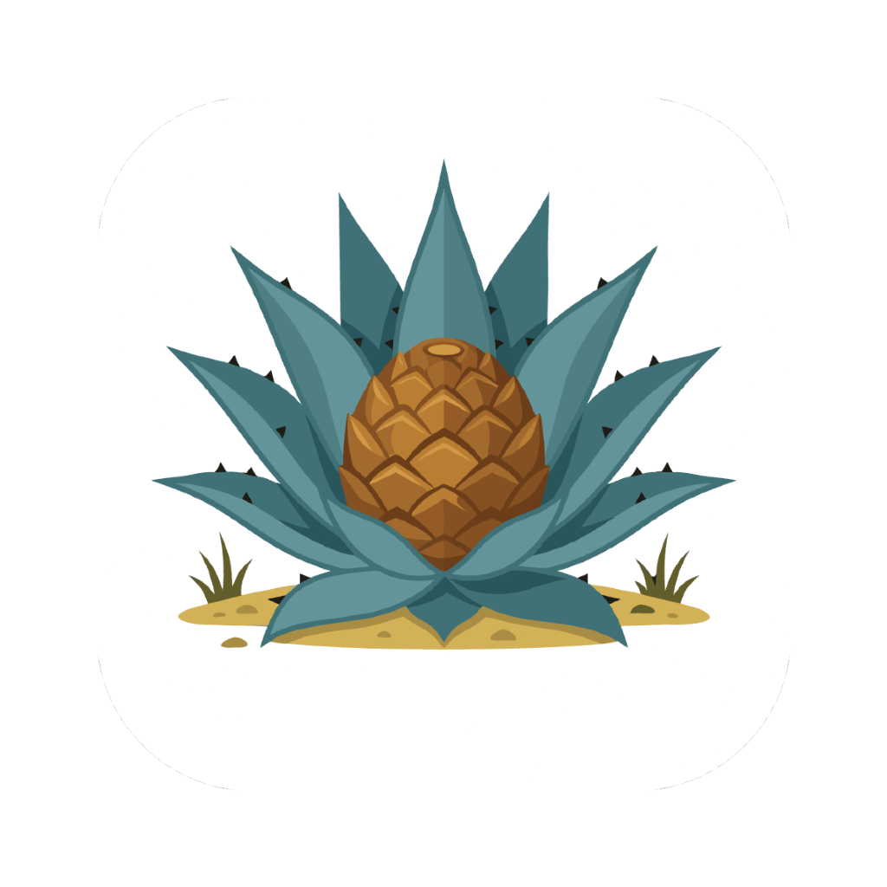
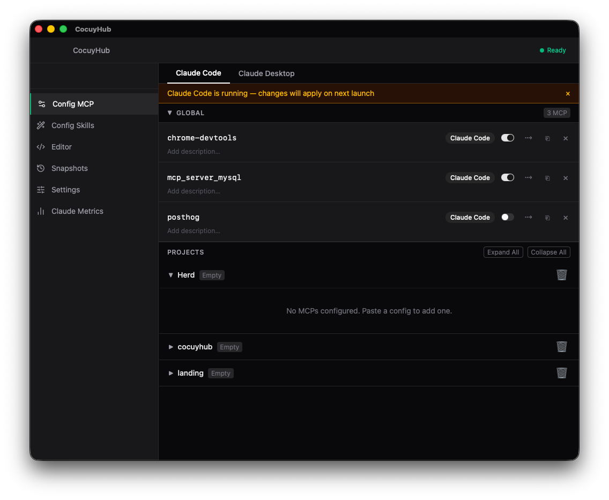

<p align="center">
  
</p>

<h1 align="center">CocuyHub</h1>

<p align="center">
  <strong>A native desktop management hub for Claude AI tools</strong>
</p>

<p align="center">
  <a href="#features">Features</a> &bull;
  <a href="#installation">Installation</a> &bull;
  <a href="#development">Development</a> &bull;
  <a href="#architecture">Architecture</a> &bull;
  <a href="#contributing">Contributing</a>
</p>

---

CocuyHub is a lightweight, native macOS desktop application that provides a unified interface for managing [Claude Code](https://docs.anthropic.com/en/docs/claude-code) (CLI) and [Claude Desktop](https://claude.ai/download) configurations. It brings together MCP server management, skill authoring, usage metrics, configuration snapshots, and more into a single, cohesive GUI.

Built with **Tauri v2**, **React 19**, and **Rust**, CocuyHub runs as a true native application with minimal resource footprint.

<p align="center">
  
</p>

## Features

### MCP Server Management

Visualize and manage all Model Context Protocol (MCP) servers across both Claude Code and Claude Desktop from a single view.

- **Toggle** servers on/off without manual JSON editing
- **Add, rename, delete**, and **annotate** MCP servers with descriptions
- **Copy** servers between Claude Code and Claude Desktop
- **Per-project MCP management** for Claude Code project-scoped configurations
- **Smart Paste** — paste any MCP config JSON snippet and CocuyHub will detect it, preview the server, and offer to install it to Code, Desktop, or a specific project

### Raw Configuration Editor

A full-featured Monaco editor (the engine behind VS Code) for direct editing of Claude configuration files.

- JSON schema validation with inline error markers
- External change detection with conflict warnings
- Atomic writes to prevent data corruption
- Keyboard shortcut: `Cmd+S` to save

### Skills Manager

Create, browse, edit, and organize Claude Code skills with a dedicated workspace.

- **Full-text search** across all skills with weighted scoring (`Cmd+K`)
- **Inline file tree** — expand any skill to browse and edit its files
- **Create** new skills with slug validation
- **Toggle** skills active/disabled
- **Copy** skills between personal, project, and desktop locations
- **Export/Import** skills as portable `.zip` archives

### Configuration Snapshots

Never lose a working configuration again. CocuyHub automatically snapshots your config before every write and supports manual named snapshots.

- **Auto-snapshots** before every configuration change
- **Manual snapshots** with custom names for Claude Code, Desktop, or both
- **One-click restore** with safety confirmation
- Keyboard shortcut: `Cmd+Shift+S` from anywhere

### MCP Profiles

Save and switch between named sets of MCP servers.

- **Create** profiles capturing the current MCP state
- **Apply** a profile to instantly swap your server configuration
- **Mixed-state detection** warns when current config has diverged from the active profile

### Claude Usage Metrics

Monitor your Claude Code usage with real-time session analytics.

- **Active session tracking** — current 5-hour window, time remaining, messages vs. limit
- **Token breakdown** — input, output, cache read, and cache create
- **Plan detection** — auto-detects Claude Pro, Max 5x, and Max 20x plans
- **Tool usage distribution** — see which tools Claude is calling most
- **Model distribution** over the past 7 days
- **Live updates** via filesystem watcher

### App Shell

- Collapsible sidebar with keyboard navigation (`Cmd+1` through `Cmd+6`)
- Health indicator showing configuration status
- Process detection for running Claude instances
- In-app auto-updates
- Window state persistence across sessions

## Tech Stack

| Layer | Technologies |
|---|---|
| **Frontend** | React 19, TypeScript 5.8, Vite 7, Tailwind CSS v4, Zustand 5, React Router 7, Monaco Editor, Radix UI |
| **Backend** | Rust (2021 edition), Tauri v2, serde, notify (fs watcher), sysinfo, chrono, zip |
| **Testing** | Vitest, Testing Library, jsdom, tempfile (Rust) |

## Installation

### From Releases

Download the latest `.dmg` from the [Releases](https://github.com/rafaelje/cocuyhub/releases) page.

### Build from Source

#### Prerequisites

- [Node.js](https://nodejs.org/) 20+
- [Yarn](https://yarnpkg.com/)
- [Rust](https://www.rust-lang.org/tools/install) (stable, via `rustup`)
- Xcode Command Line Tools (`xcode-select --install`)

```bash
# Clone the repository
git clone https://github.com/rafaelje/cocuyhub.git
cd cocuyhub

# Install dependencies
yarn install

# Build for production
yarn tauri build
```

The macOS `.app` bundle and `.dmg` installer will be generated in `src-tauri/target/release/bundle/`.

## Releases

CocuyHub uses a tag-based release pipeline powered by GitHub Actions. When a version tag is pushed, the CI automatically builds the macOS `.dmg` installer and publishes a GitHub Release with all artifacts.

### Creating a Release

```bash
git tag v0.2.0
git push origin main --tags
```

The workflow will:
1. Build the frontend and Rust backend
2. Bundle the macOS `.app` and `.dmg`
3. Sign the update artifacts for the auto-updater
4. Publish the GitHub Release with the `.dmg`, `.app.tar.gz`, and `latest.json`

Releases are available on the [Releases](https://github.com/rafaelje/cocuyhub/releases) page.

## Development

```bash
# Start the development server with hot reload
yarn tauri dev
```

This launches the Vite dev server on `http://localhost:1420` and opens the native Tauri window connected to it.

### Running Tests

```bash
# Frontend tests
yarn vitest

# Rust tests
cd src-tauri && cargo test
```

## Architecture

CocuyHub follows a strict **frontend/backend separation** through Tauri's IPC bridge:

- **All disk I/O happens in Rust** — the frontend never directly reads or writes files
- **Event-driven updates** — the Rust backend emits typed events (`config://external-change`, `snapshot://created`, `metrics://updated`) that the frontend subscribes to for reactive UI updates
- **Atomic writes** — all configuration changes go through a write pipeline that snapshots, validates, writes to a temp file, then atomically renames
- **One Zustand store per domain** — `config`, `skills`, `snapshots`, `profiles`, `metrics`, `settings`, and `app` (UI state)
- **Race condition prevention** — async operations use monotonic sequence counters to discard stale responses

## Keyboard Shortcuts

| Shortcut | Action |
|---|---|
| `Cmd+1` | MCP Config |
| `Cmd+2` | Editor |
| `Cmd+4` | Snapshots |
| `Cmd+5` | Settings |
| `Cmd+6` | Metrics |
| `Cmd+\` | Toggle sidebar |
| `Cmd+S` | Save (in editor) |
| `Cmd+K` | Search skills |
| `Cmd+Shift+S` | Create snapshot |

## Contributing

Contributions are welcome! Please feel free to submit a Pull Request.

1. Fork the repository
2. Create your feature branch (`git checkout -b feature/amazing-feature`)
3. Commit your changes (`git commit -m 'Add amazing feature'`)
4. Push to the branch (`git push origin feature/amazing-feature`)
5. Open a Pull Request

## License

This project is open source. See the [LICENSE](LICENSE) file for details.

---

<p align="center">
  Built with <a href="https://v2.tauri.app">Tauri</a>, <a href="https://react.dev">React</a>, and <a href="https://www.rust-lang.org">Rust</a>
</p>
